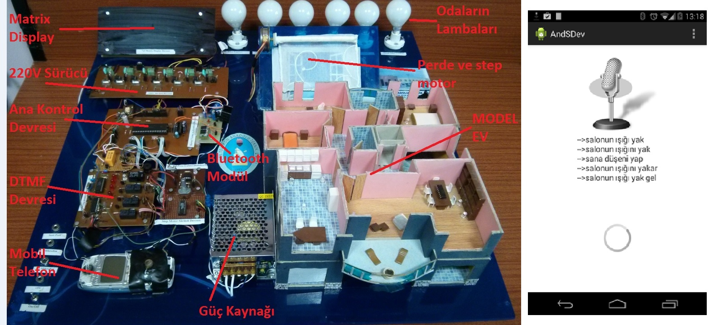

## **Android Söz Dinleyen Ev (AndSDev)**

### **Projenin Amacı :**

Android işletim sisteminin ses tanıma ve bluetooth özelliğinden faydalanılarak,

Evdeki cihazların ;
- İşlevlerine ait komutların konuşma diline yerleşmiş farklı söylem şekillerini tanıyabilen,

- Bu komutlarla kontrolünü sağlayan bir program hazırlamak. 

### **Projenin Hedefleri** :
- Bluetooth modüller ile mikrodenetleyici ve mobil telefon-tabletlerin haberleştirilmesi.
- Android işletim sisteminde ses tanıma işleminin yapılması.
- Sözel komutlara ait farklı söylem algoritmalarının oluşturulması ve yazılması.
- Sözel komutları model eve uygulama. 

#

### **Akıllı evler  :**
İçinde yaşayan insanlarla sürekli etkileşim içinde olan ve verilen emirler doğrultusunda belirlenen işlevleri bir senaryoya göre yerine getiren evlerdir. 

Buna göre;

- Bir merkezden kontrol edilebilir ve evdeki cihazlarla haberleşebilirler.
- Kullandıkları teknolojiler sayesinde ev sakinlerine, daha tasarruflu, daha güvenli, daha konforlu ve hayatı kolaylaştıran bir yaşam sunarlar.

### **Projeye Konu Olan Temel Problem**

**Komut aynı dilde söylense bile ;**
	
- Komutun sözel ifade edilişi değişebilecektir.

- Bazı durumlarda bir komut için yüzlerce farklı söylem biçimi ortaya çıkabilecektir.

- Farklı söylem biçimlerinin tanıması ile son kullanıcı zenginliği ve kullanım kolaylığı  meydana gelecektir. 
	
- Bu durumda da evdeki ve toplumdaki bireylerin tümü sistemi rahatlıkla  kullanabilecektir.

### **Proje Fikri İle İlgili Bazı Kavramlar**

- GUI(Grafik User Interface-Grafik Kullanıcı Arabirimi):  

	Kullanıcıyla etkileşimin grafik (görsel) ara yüzle sağlanması.

- VUI(Voice User Interface-Ses Kullanıcı Arabirimi) : 

	Kullanıcı ile etkileşimin ses ile sağlanması.

- FSB(Farklı Söylem Biçimleri) :

 	Ses ara yüzü için bir komutun söyleminin  farklı ifade edilmesi.

### **Sistemin Temel Çalışması**

### **Kullanılan Teknolojiler**
- Mikrodenetleyiciler PIC18F452
- CCS PIC C programlama dili.
- Bluetooth haberleşmesi(mobil tel., tablet)
- Android programlama.
- PCB çizim teknikleri.

### **NOT: Bu çalışma TUBİTAK proje yarışmasında Türkiye genelinde mansiyon almıştır.**

