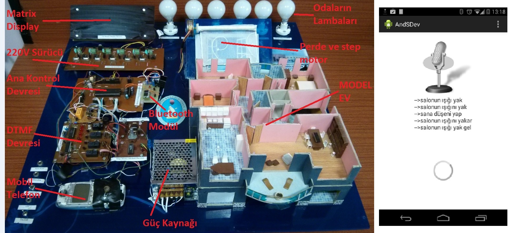
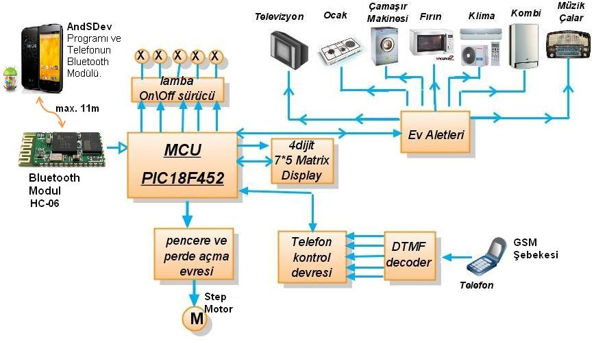

## **Android Obedient House (AndSDev)**

### **The goal of the project:**

By taking advantage of the voice recognition and Bluetooth features of the Android operating system,

devices at home;
- Being able to recognize different forms of discourse embedded in spoken language regarding the functions of voice commands,

- To prepare a program that provides control with these commands. 

### **Project Goals** :
- Communication of microcontrollers and mobile phones-tablets with Bluetooth modules.
- Performing voice recognition in the Android operating system.
- Creating and writing different discourse algorithms for verbal commands.
- Applying verbal commands to the model home.

#

### **Smart homes  :**
These are houses that are in constant interaction with the people living in them and perform functions determined according to a scenario in line with the orders given.
According to this;

- They can be controlled from a center and communicate with devices in the house.
- Thanks to the technologies they use, they offer their residents a more economical, safer, more comfortable and easier life.

### **The Main Problem Subject to the Project**

**Even if the command is spoken in the same language;**
	
- The verbal expression of the command may vary.

- In some cases, hundreds of different discourse styles can emerge for a single command.

- By recognizing different forms of discourse, end-user richness and ease of use will emerge.
	
- In this case, all individuals in the home and society will be able to use the system easily.

### **Some Concepts About the Project Idea**

- GUI(Grafik User Interface):  

	Providing interaction with the user through a graphical (visual) interface.

- VUI(Voice User Interface) : 

	Interaction with the user is provided by voice.

- FSB(Different Forms of Discourse) :

 	Different expressions of the discourse of a command for the voice interface.

### **Basic Operation of the System**

### **Used technologies**
- Mikrocontrollers PIC18F452
- CCS PIC C compiler.
- Bluetooth communication
- Android programming.
- PCB drawing techniques.

### **NOTE: This study was deemed worthy of an honorable mention (Fourth place) in the TÜBİTAK project competition held throughout Türkiye.**
<a href="https://tubitak.gov.tr/en/competitions/2204-high-school-students-research-projects-competition" target="_blank">
	(TUBITAK High School Students Research Projects Competition)
</a>

